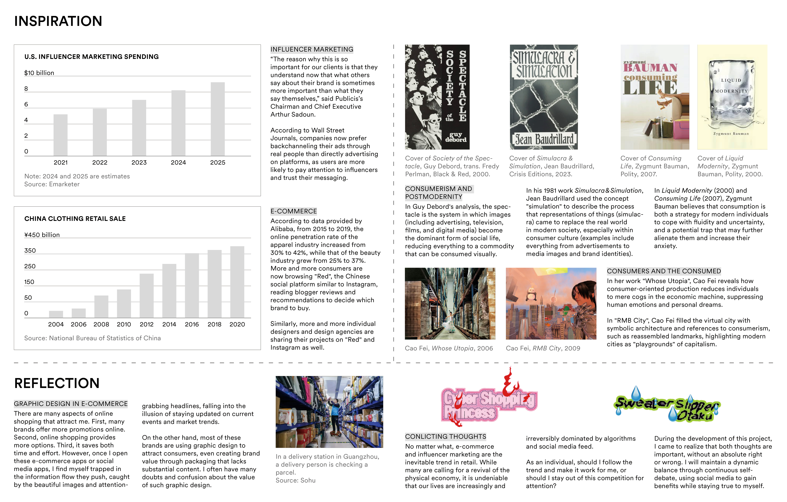
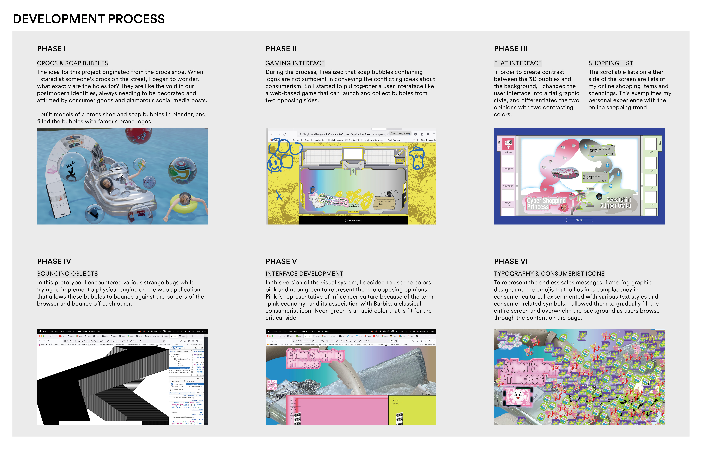
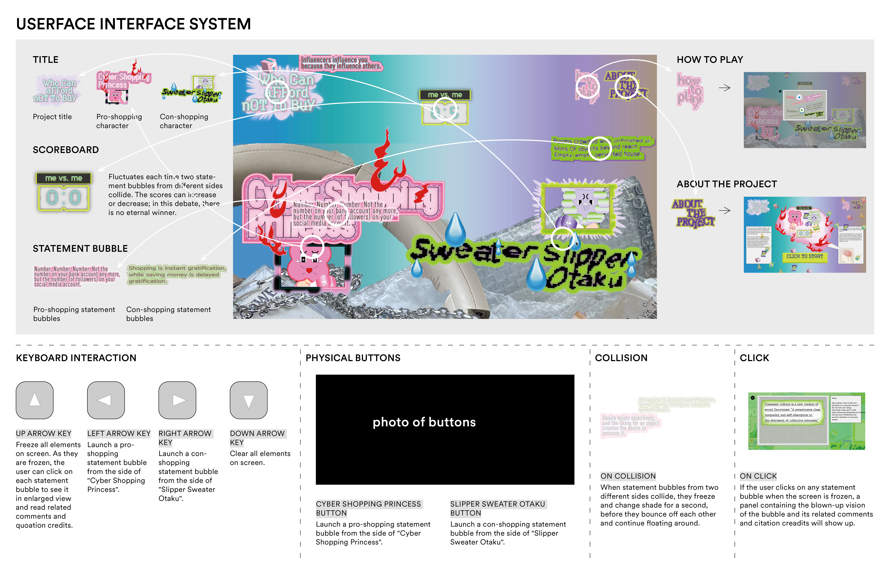

# Who Can Afford Not to Buy

### Overview
This is a presentation of my own conflicting thoughts about **consumer culture** and **personal identity**.

I have had this debate going on in my head for years. On the one side is my desire to attain or pretend **"a better self"** through online shopping; on the other is my sanity that raises **doubts against consumerism**, trending aesthetics and influencer culture.

---

### Research

---

### Development Process

### Methods
-  **matter.js**: A physical engine for JavaScript.

---

### User Interface System

---

### Demo

